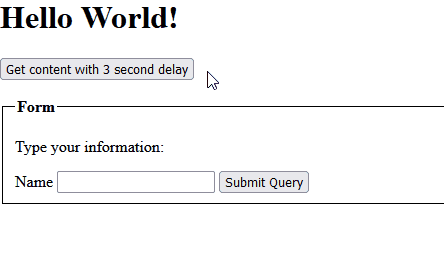

# htmx-mini
htmx is about 40KB _minified_, htmx-mini is <4KB _**un**minified_.  
The project consists of a single JavaScript file, which is very easy to modify and extend.

You can read about the development of this [on my website](https://stigsen.xyz/blog/developing-an-htmx-alternative.html).

## Documentation
This does not contain all the functionality of htmx, _but_, it does contain
what I consider to be the most valueable part of htmx.

With htmx-mini you are able to create `GET`, `POST`, `PUT`, `DELETE`, `PATCH` requests.
It also allows for you to add certain triggers like `click`, `submit` and whatever else may exist,
together with targets that you want to replace the HTML of.

It supports the following swap modes:
- `innerHTML`
- `outerHTML`
- `beforebegin`
- `afterbegin`
- `beforeend`
- `afterend`
- `delete`
- `none`

If no trigger is defined, it uses the same defaults as htmx:
- `input`, `textarea` and `select` are triggered by the `change` event
- `form` is triggered on the `submit` event
- ... everything else uses `click`

If a form is triggered, it includes the form data in the Ajax request.

Like htmx we expect the data returned by the server to be HTML.

## Example
```html
<h1 id="mytitle">Hello World!</h1>
<button data-hxm-req="get" data-hxm-url="/content" data-hxm-target="#mytitle" data-hxm-delay="3000">
    Get content with 3 second delay
</button>

<br>

<p>Type your information:</p>
<form data-hxm-req="post" data-hxm-target="p" data-hxm-swap="innerHTML">
    <label>Name <input type="text" name="name" /></label>
    <input type="submit" />
</form>
```



## Why?
Size matters.
